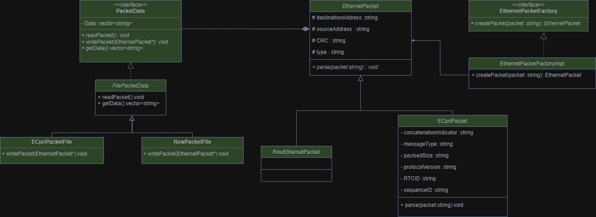

# Ethernet-Parser


## How To Run :
1. **Move Input File**: Place your input file in the same directory as the project.

2. **Open Terminal/Command Prompt**: Open a terminal or Command Prompt window.

3. **Run the Program :** Execute the following command to build and run your program:

   ```bash
   .\build_and_run.bat

---
## UML Diagram :


---
